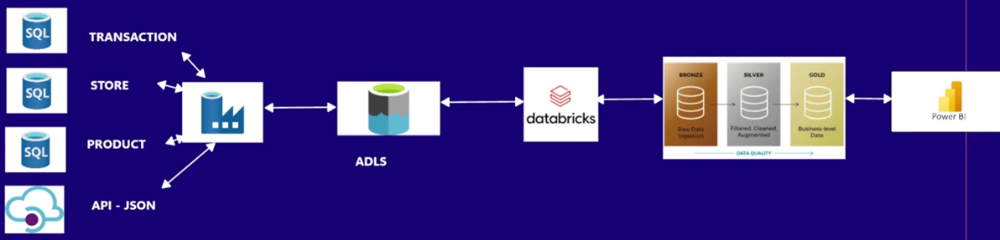
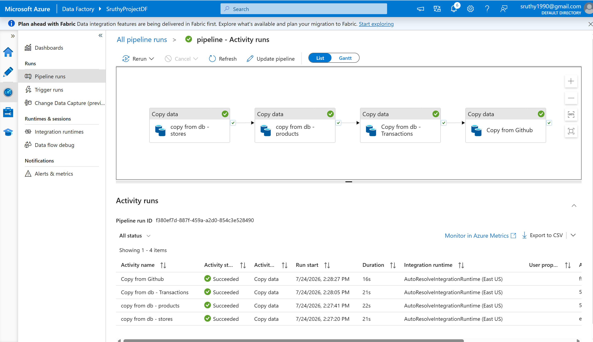
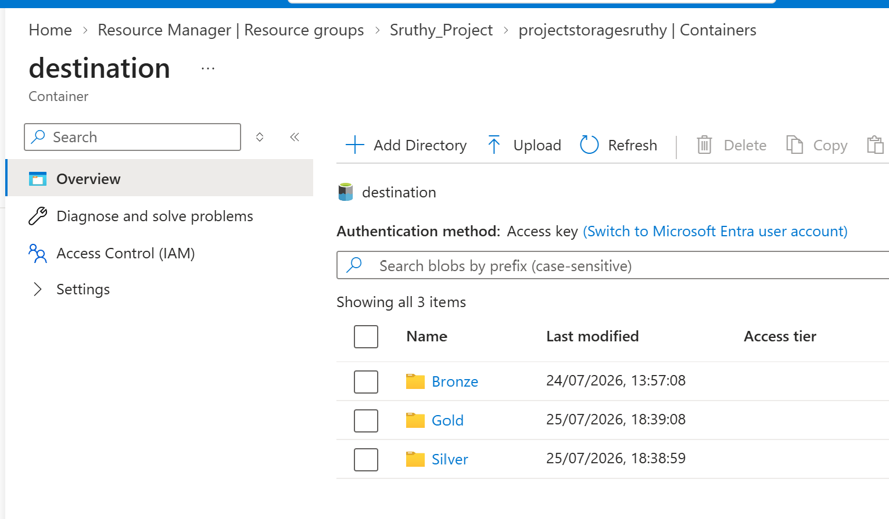
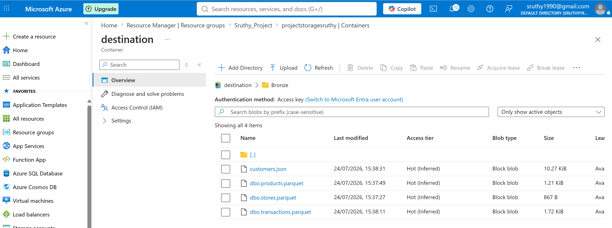
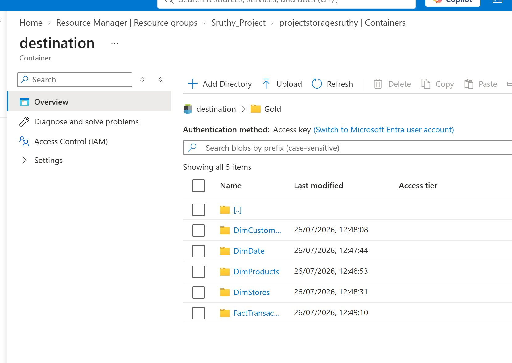
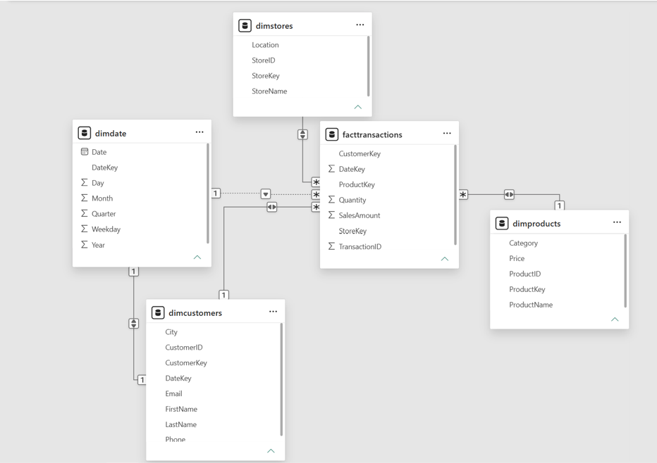
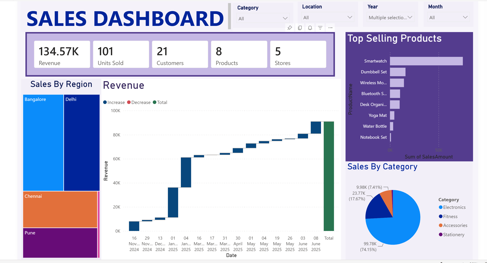

# Azure End-to-End Data Engineering Pipeline — Retail Analytics

An end-to-end data engineering pipeline built on Azure that ingests multi-source retail data, processes it through a Bronze–Silver–Gold Lakehouse architecture, and serves curated insights to Power BI.

**Stack:** Azure Data Factory · Azure Data Lake Storage Gen2 · Azure Databricks · Power BI · SQL Database

---

## Architecture



**Data flow:**
1. Source data ( SQL DB tables + external API) is ingested via **Azure Data Factory**.
2. Raw files land in the **Bronze** layer of **Azure Data Lake Storage (ADLS)**.
3. **Azure Databricks** cleans, transforms, and enriches the data into the **Silver** layer.
4. Business-ready, aggregated data is written to the **Gold** layer.
5. **Power BI** connects to the Gold layer for reporting and dashboards.

---

## Business Requirements

- Build an end-to-end data pipeline for a retail client.
- Ingest data from multiple heterogeneous sources into a centralized data lake.
- Combine structured transaction, store, and product data (from Azure SQL DB) with semi-structured customer data (from a JSON API).
- Organize the lake using a medallion architecture (Bronze / Silver / Gold) to progressively clean and refine the data.
- Power a Power BI reporting layer from curated, business-level data.

---

## Data Sources

| Source | Format | Description |
|---|---|---|
| SQL Database | Relational tables | `products`, `stores`, `transactions` |
| REST API | JSON | Customer data ([sample source](data_sql_and_json/customers.json)) |

### SQL Schema

<details>
<summary>Click to expand table definitions</summary>

```sql
-- Products Table
CREATE TABLE products (
    product_id INT PRIMARY KEY,
    product_name VARCHAR(100),
    category VARCHAR(50),
    price DECIMAL(10,2)
);

-- Stores Table
CREATE TABLE stores (
    store_id INT PRIMARY KEY,
    store_name VARCHAR(100),
    location VARCHAR(100)
);

-- Transactions Table
CREATE TABLE transactions (
    transaction_id INT PRIMARY KEY,
    customer_id INT,
    product_id INT,
    store_id INT,
    quantity INT,
    transaction_date DATE,
    FOREIGN KEY (product_id) REFERENCES products(product_id),
    FOREIGN KEY (store_id) REFERENCES stores(store_id)
);
```
Schema creation template for all three tables is included in [`/sql`](data_sql_and_json/create_tables.sql)
Sample data for all three tables is included in [`/sql`](data_sql_and_json/Sample_data.sql)

</details>

---

## Project Setup

1. ** SQL DB** — export `transactions`, `stores`, and `products` tables, each converted to **Parquet** format during ingestion.
2. **API ingestion** — pull customer data from the GitHub-hosted JSON API endpoint.
3. **ADLS containers** — create `bronze`, `silver`, and `gold` containers.
   - Upload the 4 raw source files into `bronze`.
4. **Silver layer** — clean and standardize the raw data using Databricks notebooks (deduplication, schema enforcement, type casting).
5. **Gold layer** — aggregate and model the data into business-level tables to power Power BI dashboards.

---

## Screenshots


### Azure Data Factory Pipeline


### ADLS Container Structure (Bronze / Silver / Gold)





### Databricks Notebook — Transformation


### Power BI



---

## Tech Stack

- **Ingestion:** Azure Data Factory
- **Storage:** Azure Data Lake Storage Gen2 (medallion architecture)
- **Transformation:** Azure Databricks (PySpark)
- **Source systems:** SQL Database, REST API (JSON)
- **Reporting:** Power BI

## What I Learned

- Designing a medallion (Bronze/Silver/Gold) architecture for progressive data refinement.
- Orchestrating multi-source ingestion (relational + API/JSON) with Azure Data Factory.
- Using Databricks to clean and transform raw data at scale before serving it to BI tools.
- using PowerBI to create interactive dashboard
